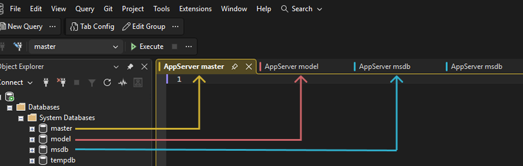
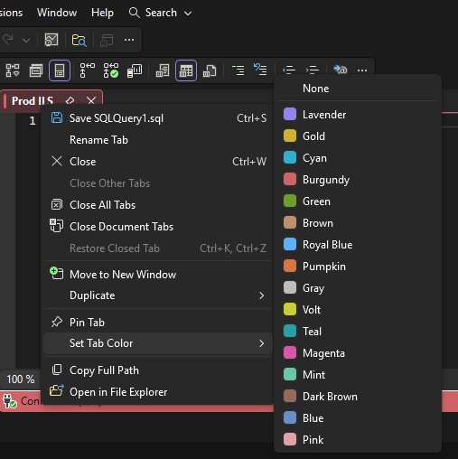

# SSMS EnvTabs

A Visual Studio Extension for SQL Server Management Studio (SSMS) that automatically names query tabs and leverages SSMS's native regex feature to color them based on server and database connections. Keep your production, QA, and development environments visually distinct and easily identifiable.




## Key Features

- **Color-Coded Tabs** - 16 distinct colors to visually separate different environments
- **Tab Renaming** - Automatically name query tabs with environment names (e.g., "1. Prod", "1. QA")
- **Auto-Configuration** - Automatically create rules for new connections (retained between sessions)
- **Manual-Regex** - Add your own regex that you want applied to the ColorByRegexConfig.txt file (retained between sessions)

## Install
Download the latest `.vsix` from [GitHub Releases](https://github.com/Blake-goofy/SSMS-EnvTabs/releases) and run the installer.


### On-Demand Configuration

When you connect to a server or database that doesn't have a matching rule, EnvTabs will prompt you to configure it. This ensures you only create rules for the connections you actually use!


### Change Tab Color

You can also change a tab color directly in SSMS. Right-click the query tab, choose **Set Tab Color**, and pick a color.



### Example Configuration

```json
{
  "settings": {
    "enableLogging": false,
    "enableAutoRename": true,
    "enableAutoColor": true,
    "enableConfigurePrompt": true,
    "enableConnectionPolling": true,
    "enableUpdateChecks": true,
    "autoConfigure": "server db",
    "newQueryRenameStyle": "[#]. [groupName]"
  },
  "serverAlias": {
    "MY-LONG-SERVER-NAME": "AppServer"
  },
  "connectionGroups": [
    {
      "groupName": "Example: Exact Match",
      "server": "MY-LONG-SERVER-NAME",
      "database": "MyDatabase",
      "priority": 10,
      "colorIndex": 9
    }
  ]
}

```
## Documentation

Full documentation is available in the [GitHub Wiki](https://github.com/Blake-goofy/SSMS-EnvTabs/wiki).

- **[Installation](https://github.com/Blake-goofy/SSMS-EnvTabs/wiki/Installation-Guide)**: Setup and requirements.
- **[Updating](https://github.com/Blake-goofy/SSMS-EnvTabs/wiki/Updating)**: How updates work and how to check manually.
- **[Configuration](https://github.com/Blake-goofy/SSMS-EnvTabs/wiki/Configuration-Guide)**: Global settings and prompts.
- **[Group Rules](https://github.com/Blake-goofy/SSMS-EnvTabs/wiki/Group-Rules)**: Creating rules for your servers.
- **[Manual Regex Rules](https://github.com/Blake-goofy/SSMS-EnvTabs/wiki/Manual-Regex)**: Advanced regex matching overrides.
- **[Tab Text Settings](https://github.com/Blake-goofy/SSMS-EnvTabs/wiki/Tab-Text-Settings)**: How to clean up tab text.
- **[Tab Appearance](https://github.com/Blake-goofy/SSMS-EnvTabs/wiki/Tab-Appearance)**: Customizing tab naming for new vs saved queries.
- **[Configuration Prompts](https://github.com/Blake-goofy/SSMS-EnvTabs/wiki/Configuration-Prompts)**: Prompts and warnings you may see.
- **[Tools Menu and Buttons](https://github.com/Blake-goofy/SSMS-EnvTabs/wiki/Tools-Menu-Buttons)**: Show or hide the EnvTabs menu group and buttons.
- **[Color Reference](https://github.com/Blake-goofy/SSMS-EnvTabs/wiki/Color-Reference)**: List of available colors (0-15).
- **[Wildcard Patterns](https://github.com/Blake-goofy/SSMS-EnvTabs/wiki/Wildcard-Patterns)**: Matching syntax.
- **[How it Works](https://github.com/Blake-goofy/SSMS-EnvTabs/wiki/How-it-works)**: Technical details.
- **[Troubleshooting](https://github.com/Blake-goofy/SSMS-EnvTabs/wiki/Troubleshooting)**: Common issues and solutions.

## Support & Contributing

*   **Issues**: [GitHub Issues](https://github.com/Blake-goofy/SSMS-EnvTabs/issues)
*   **Discussions**: [GitHub Discussions](https://github.com/Blake-goofy/SSMS-EnvTabs/discussions)
*   **Source Code**: To build from source, clone the repo and open `SSMS EnvTabs.sln` in Visual Studio 2019+ (VS SDK required).

## Author

**Blake Becker**

---

If you find this extension helpful, please consider giving it a star!
